# 07 — Sequence Diagrams

| Field | Value |
|---|---|
| **Version** | 3.0 |
| **Status** | Final draft — implementation-ready |
| **Last Updated** | 2026-10-08 |
| **Source of Truth** | The finalization prompt ("SoT") overrides older documents. Diagrams follow the transaction boundaries in `05-SYSTEM_DESIGN.md` §14. `Note` boxes mark transaction (Tx) scope; external calls are always outside Tx. |

Participants: `FE` frontend, `API` controller+service, `DB` PostgreSQL, `Q` BullMQ/Redis, `PM` Paymob.

---

## 1. Login

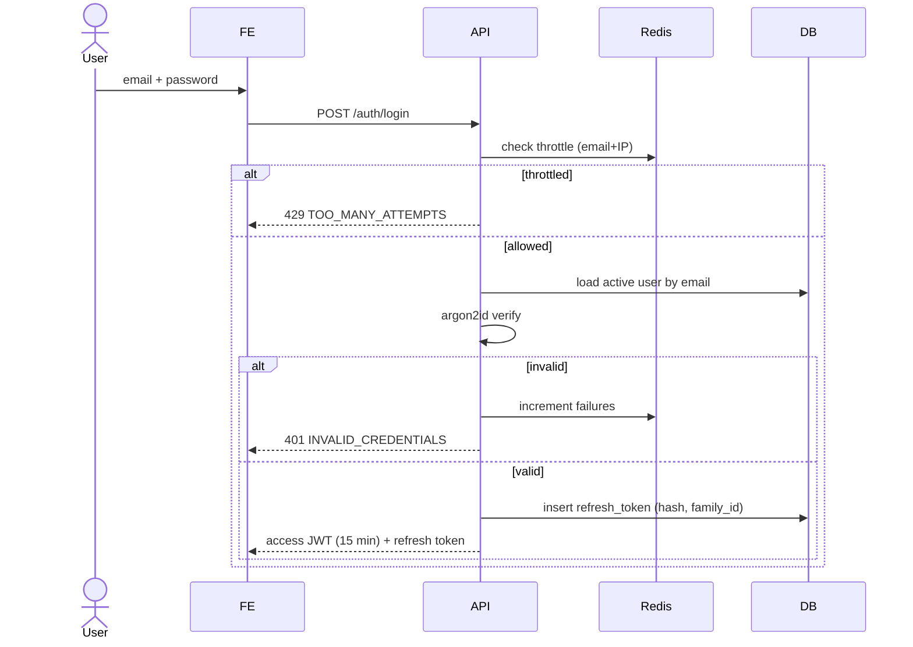
```mermaid
sequenceDiagram
  actor U as User
  participant FE
  participant API
  participant R as Redis
  participant DB
  U->>FE: email + password
  FE->>API: POST /auth/login
  API->>R: check throttle (email+IP)
  alt throttled
    API-->>FE: 429 TOO_MANY_ATTEMPTS
  else allowed
    API->>DB: load active user by email
    API->>API: argon2id verify
    alt invalid
      API->>R: increment failures
      API-->>FE: 401 INVALID_CREDENTIALS
    else valid
      API->>DB: insert refresh_token (hash, family_id)
      API-->>FE: access JWT (15 min) + refresh token
    end
  end
```

## 2. Check-in — GPS + Geofence (step 1)

```mermaid
sequenceDiagram
  actor E as Employee
  participant FE
  participant API
  participant DB
  E->>FE: tap Check in
  FE->>API: POST /attendance/check-in {lat, lng, accuracy}
  API->>DB: read attendance, pending verification, leave, schedule, calendar
  alt attendance CONFIRMED
    API-->>FE: 409 ALREADY_CHECKED_IN
  else pending verification not expired
    API-->>FE: 200 same verificationId (idempotent)
  else not eligible (off day without exception, leave, closed, not open; on an exception day the windows are skipped and the day is GREEN)
    API-->>FE: 422 reason code
  else eligible
    API->>API: accuracy <= threshold, Haversine vs assigned locations
    alt accuracy too low
      API-->>FE: 422 GPS_ACCURACY_TOO_LOW
    else outside all radii
      API-->>FE: 422 OUTSIDE_GEOFENCE
    else inside a location
      API->>DB: insert verification PENDING (started_at=now, expires_at=now+15m)
      Note over API,DB: unique partial index: one PENDING per user and date
      API-->>FE: 201 {verificationId, locationId, expiresAt}
      Note over FE: no attendance and no point yet
    end
  end
```

## 3. QR verification within 15 minutes (step 2)

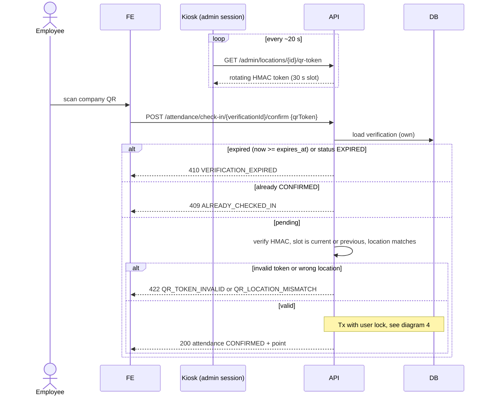
```mermaid
sequenceDiagram
  actor E as Employee
  participant FE
  participant K as Kiosk (admin session)
  participant API
  participant DB
  loop every ~20 s
    K->>API: GET /admin/locations/{id}/qr-token
    API-->>K: rotating HMAC token (30 s slot)
  end
  E->>FE: scan company QR
  FE->>API: POST /attendance/check-in/{verificationId}/confirm {qrToken}
  API->>DB: load verification (own)
  alt expired (now >= expires_at) or status EXPIRED
    API-->>FE: 410 VERIFICATION_EXPIRED
  else already CONFIRMED
    API-->>FE: 409 ALREADY_CHECKED_IN
  else pending
    API->>API: verify HMAC, slot is current or previous, location matches
    alt invalid token or wrong location
      API-->>FE: 422 QR_TOKEN_INVALID or QR_LOCATION_MISMATCH
    else valid
      Note over API,DB: Tx with user lock, see diagram 4
      API-->>FE: 200 attendance CONFIRMED + point
    end
  end
```

## 4. Attendance classification and point award

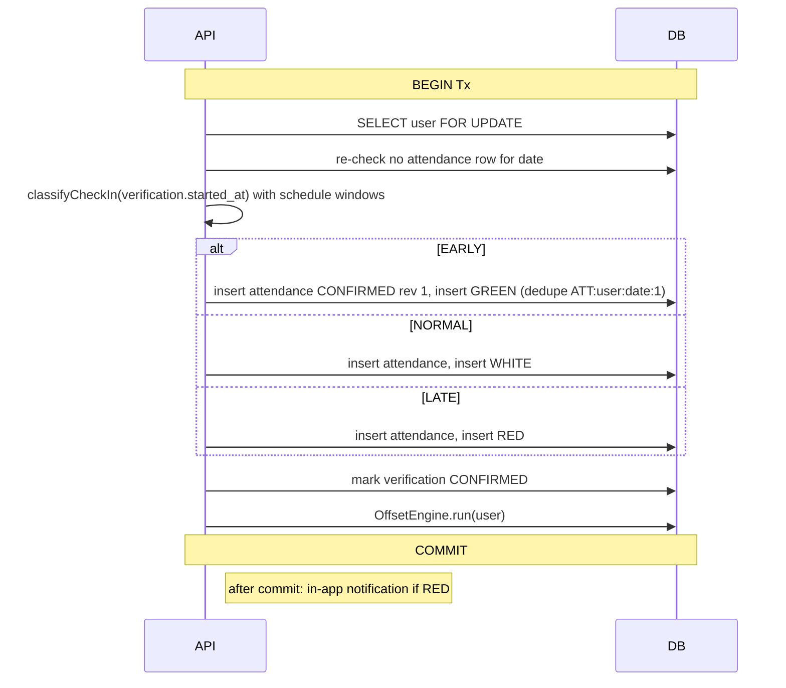
```mermaid
sequenceDiagram
  participant API
  participant DB
  Note over API,DB: BEGIN Tx
  API->>DB: SELECT user FOR UPDATE
  API->>DB: re-check no attendance row for date
  API->>API: classifyCheckIn(verification.started_at) with schedule windows
  alt EARLY
    API->>DB: insert attendance CONFIRMED rev 1, insert GREEN (dedupe ATT:user:date:1)
  else NORMAL
    API->>DB: insert attendance, insert WHITE
  else LATE
    API->>DB: insert attendance, insert RED
  end
  API->>DB: mark verification CONFIRMED
  API->>DB: OffsetEngine.run(user)
  Note over API,DB: COMMIT
  Note right of API: after commit: in-app notification if RED
```

## 5. Check-out

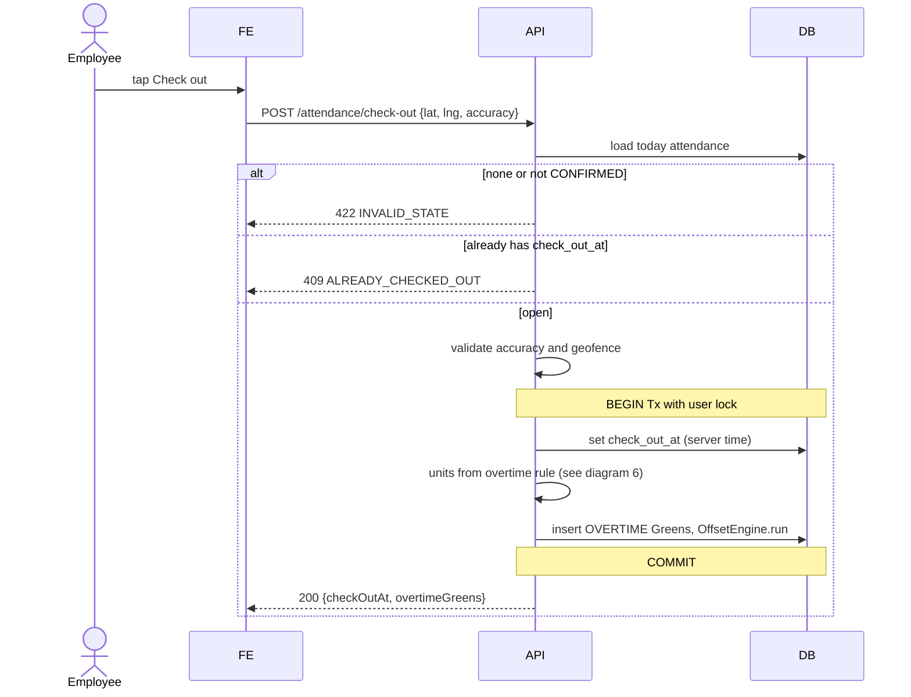
```mermaid
sequenceDiagram
  actor E as Employee
  participant FE
  participant API
  participant DB
  E->>FE: tap Check out
  FE->>API: POST /attendance/check-out {lat, lng, accuracy}
  API->>DB: load today attendance
  alt none or not CONFIRMED
    API-->>FE: 422 INVALID_STATE
  else already has check_out_at
    API-->>FE: 409 ALREADY_CHECKED_OUT
  else open
    API->>API: validate accuracy and geofence
    Note over API,DB: BEGIN Tx with user lock
    API->>DB: set check_out_at (server time)
    API->>API: units from overtime rule (see diagram 6)
    API->>DB: insert OVERTIME Greens, OffsetEngine.run
    Note over API,DB: COMMIT
    API-->>FE: 200 {checkOutAt, overtimeGreens}
  end
```

## 6. Overtime Green

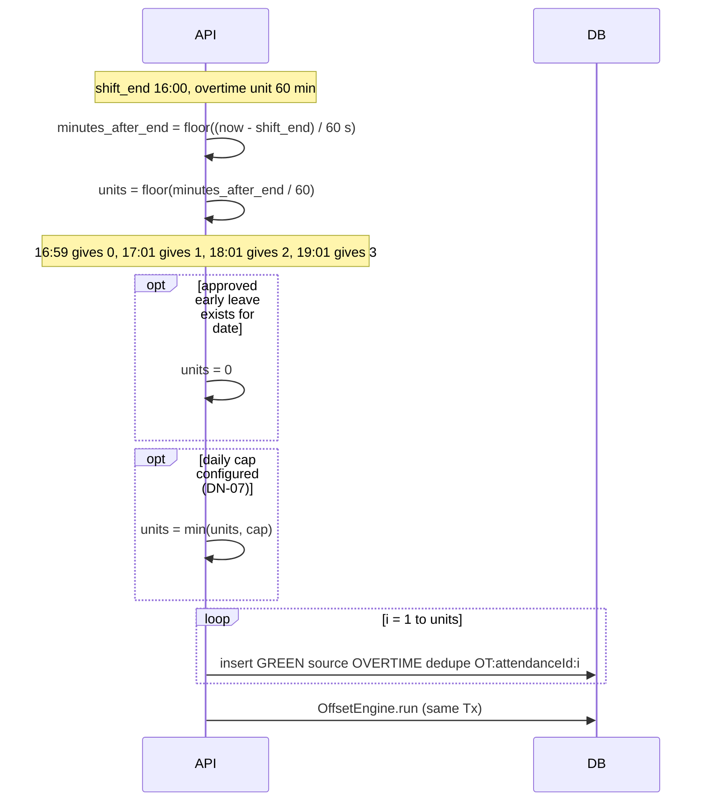
```mermaid
sequenceDiagram
  participant API
  participant DB
  Note over API: shift_end 16:00, overtime unit 60 min
  API->>API: minutes_after_end = floor((now - shift_end) / 60 s)
  API->>API: units = floor(minutes_after_end / 60)
  Note over API: 16:59 gives 0, 17:01 gives 1, 18:01 gives 2, 19:01 gives 3
  opt approved early leave exists for date
    API->>API: units = 0
  end
  opt daily cap configured (DN-07)
    API->>API: units = min(units, cap)
  end
  loop i = 1 to units
    API->>DB: insert GREEN source OVERTIME dedupe OT:attendanceId:i
  end
  API->>DB: OffsetEngine.run (same Tx)
```

## 7. Daily absence Black job

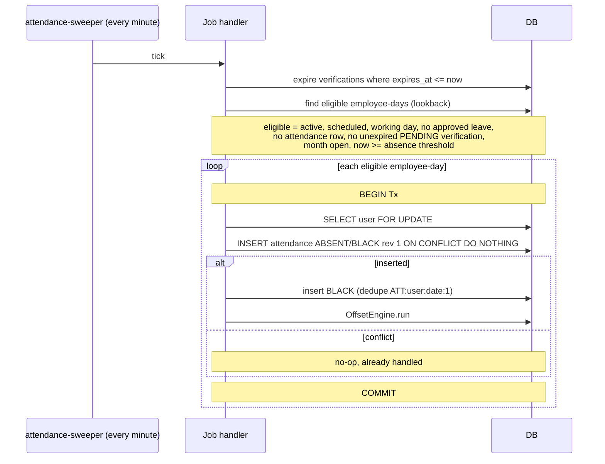
```mermaid
sequenceDiagram
  participant Q as attendance-sweeper (every minute)
  participant API as Job handler
  participant DB
  Q->>API: tick
  API->>DB: expire verifications where expires_at <= now
  API->>DB: find eligible employee-days (lookback)
  Note over API,DB: eligible = active, scheduled, working day, no approved leave,<br/>no attendance row, no unexpired PENDING verification,<br/>month open, now >= absence threshold
  loop each eligible employee-day
    Note over API,DB: BEGIN Tx
    API->>DB: SELECT user FOR UPDATE
    API->>DB: INSERT attendance ABSENT/BLACK rev 1 ON CONFLICT DO NOTHING
    alt inserted
      API->>DB: insert BLACK (dedupe ATT:user:date:1)
      API->>DB: OffsetEngine.run
    else conflict
      Note over API,DB: no-op, already handled
    end
    Note over API,DB: COMMIT
  end
```

## 8. Green cancels Red

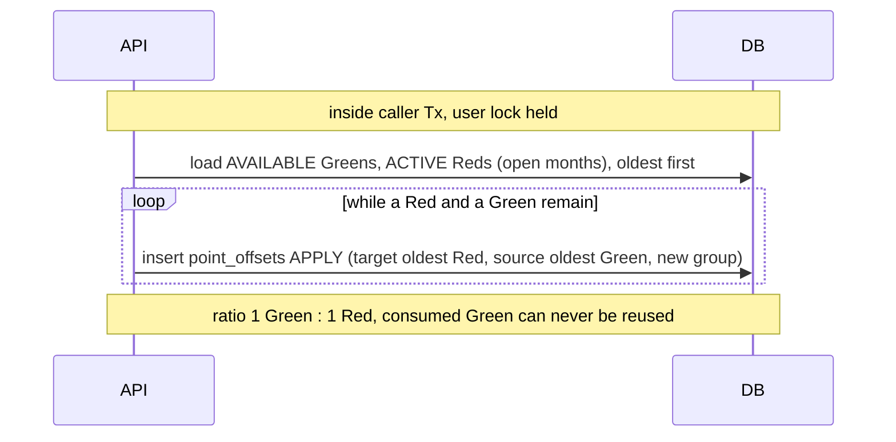
```mermaid
sequenceDiagram
  participant API
  participant DB
  Note over API,DB: inside caller Tx, user lock held
  API->>DB: load AVAILABLE Greens, ACTIVE Reds (open months), oldest first
  loop while a Red and a Green remain
    API->>DB: insert point_offsets APPLY (target oldest Red, source oldest Green, new group)
  end
  Note over API,DB: ratio 1 Green : 1 Red, consumed Green can never be reused
```

## 9. Green cancels Black

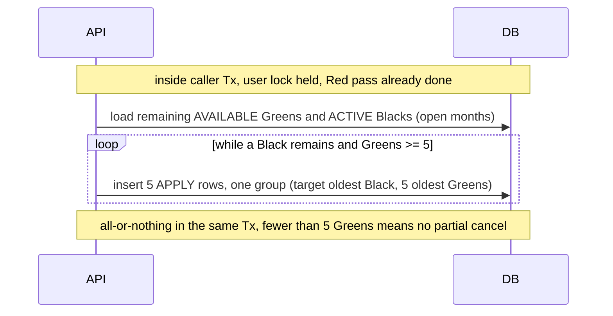
```mermaid
sequenceDiagram
  participant API
  participant DB
  Note over API,DB: inside caller Tx, user lock held, Red pass already done
  API->>DB: load remaining AVAILABLE Greens and ACTIVE Blacks (open months)
  loop while a Black remains and Greens >= 5
    API->>DB: insert 5 APPLY rows, one group (target oldest Black, 5 oldest Greens)
  end
  Note over API,DB: all-or-nothing in the same Tx, fewer than 5 Greens means no partial cancel
```

## 10. Leave request + approval

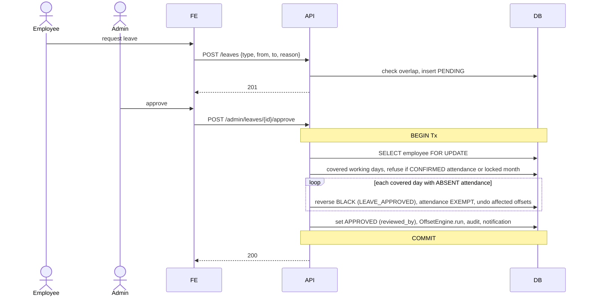
```mermaid
sequenceDiagram
  actor E as Employee
  actor A as Admin
  participant FE
  participant API
  participant DB
  E->>FE: request leave
  FE->>API: POST /leaves {type, from, to, reason}
  API->>DB: check overlap, insert PENDING
  API-->>FE: 201
  A->>FE: approve
  FE->>API: POST /admin/leaves/{id}/approve
  Note over API,DB: BEGIN Tx
  API->>DB: SELECT employee FOR UPDATE
  API->>DB: covered working days, refuse if CONFIRMED attendance or locked month
  loop each covered day with ABSENT attendance
    API->>DB: reverse BLACK (LEAVE_APPROVED), attendance EXEMPT, undo affected offsets
  end
  API->>DB: set APPROVED (reviewed_by), OffsetEngine.run, audit, notification
  Note over API,DB: COMMIT
  API-->>FE: 200
```

## 11. Early leave request + approval

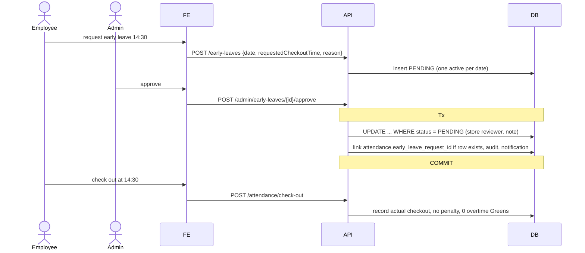
```mermaid
sequenceDiagram
  actor E as Employee
  actor A as Admin
  participant FE
  participant API
  participant DB
  E->>FE: request early leave 14:30
  FE->>API: POST /early-leaves {date, requestedCheckoutTime, reason}
  API->>DB: insert PENDING (one active per date)
  A->>FE: approve
  FE->>API: POST /admin/early-leaves/{id}/approve
  Note over API,DB: Tx
  API->>DB: UPDATE ... WHERE status = PENDING (store reviewer, note)
  API->>DB: link attendance.early_leave_request_id if row exists, audit, notification
  Note over API,DB: COMMIT
  E->>FE: check out at 14:30
  FE->>API: POST /attendance/check-out
  API->>DB: record actual checkout, no penalty, 0 overtime Greens
```

## 12. Admin point adjustment

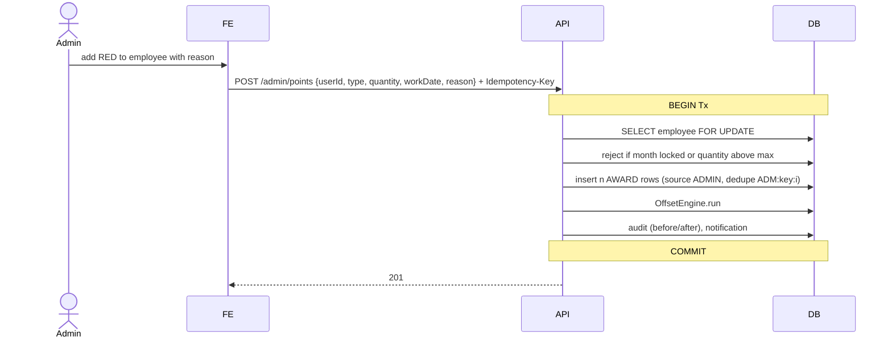
```mermaid
sequenceDiagram
  actor A as Admin
  participant FE
  participant API
  participant DB
  A->>FE: add RED to employee with reason
  FE->>API: POST /admin/points {userId, type, quantity, workDate, reason} + Idempotency-Key
  Note over API,DB: BEGIN Tx
  API->>DB: SELECT employee FOR UPDATE
  API->>DB: reject if month locked or quantity above max
  API->>DB: insert n AWARD rows (source ADMIN, dedupe ADM:key:i)
  API->>DB: OffsetEngine.run
  API->>DB: audit (before/after), notification
  Note over API,DB: COMMIT
  API-->>FE: 201
```

## 13. Point reversal

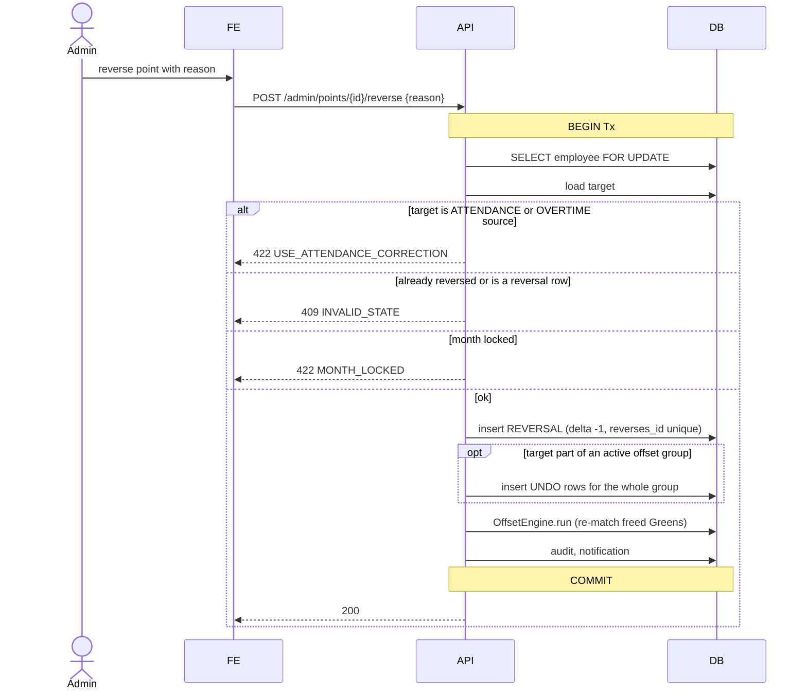
```mermaid
sequenceDiagram
  actor A as Admin
  participant FE
  participant API
  participant DB
  A->>FE: reverse point with reason
  FE->>API: POST /admin/points/{id}/reverse {reason}
  Note over API,DB: BEGIN Tx
  API->>DB: SELECT employee FOR UPDATE
  API->>DB: load target
  alt target is ATTENDANCE or OVERTIME source
    API-->>FE: 422 USE_ATTENDANCE_CORRECTION
  else already reversed or is a reversal row
    API-->>FE: 409 INVALID_STATE
  else month locked
    API-->>FE: 422 MONTH_LOCKED
  else ok
    API->>DB: insert REVERSAL (delta -1, reverses_id unique)
    opt target part of an active offset group
      API->>DB: insert UNDO rows for the whole group
    end
    API->>DB: OffsetEngine.run (re-match freed Greens)
    API->>DB: audit, notification
    Note over API,DB: COMMIT
    API-->>FE: 200
  end
```

## 14. Month Close + Payroll

```mermaid
sequenceDiagram
  actor A as Admin
  participant FE
  participant API
  participant DB
  A->>FE: preview month
  FE->>API: GET /admin/payroll/months/{month}/preview
  API-->>FE: records (not stored), blockers, warnings
  A->>FE: close month (EGP only, no exchange rate)
  FE->>API: POST /admin/payroll/months/{month}/close
  API->>DB: pre-checks (month ended, earlier months locked, no pending leaves, Green value configured)
  Note over API,DB: BEGIN single Tx
  API->>DB: lock payroll_months row, lock all users ascending id
  loop each employee
    API->>DB: OffsetEngine.run
    API->>API: calculatePayroll (pure; includes off-day-work pay = salary / 30 per exception day worked)
    API->>DB: insert payroll_records snapshot
    opt greens_remaining > 0 (see diagram 15)
      API->>DB: insert fund MONTH_CLOSE_CREDIT
    end
  end
  API->>DB: set month LOCKED (locked_at, locked_by), audit, notifications
  Note over API,DB: COMMIT, month now immutable (trigger)
  API-->>FE: 200 summary
```

## 15. Green → Fund

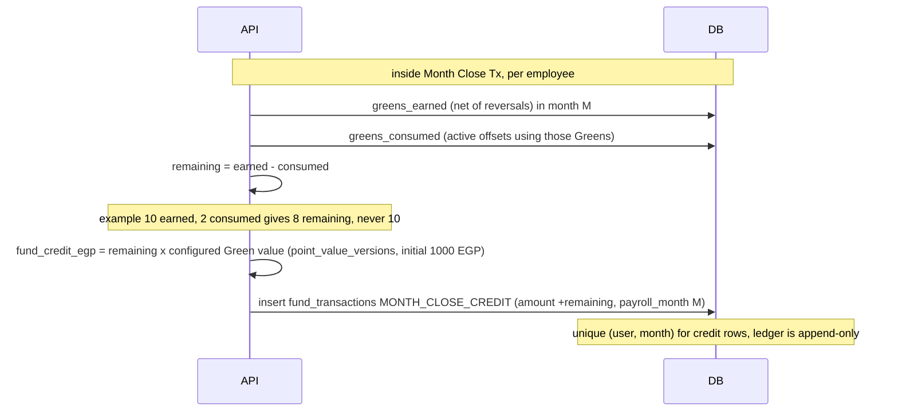
```mermaid
sequenceDiagram
  participant API
  participant DB
  Note over API,DB: inside Month Close Tx, per employee
  API->>DB: greens_earned (net of reversals) in month M
  API->>DB: greens_consumed (active offsets using those Greens)
  API->>API: remaining = earned - consumed
  Note over API: example 10 earned, 2 consumed gives 8 remaining, never 10
  API->>API: fund_credit_egp = remaining x configured Green value (point_value_versions, initial 1000 EGP)
  API->>DB: insert fund_transactions MONTH_CLOSE_CREDIT (amount +remaining, payroll_month M)
  Note over DB: unique (user, month) for credit rows, ledger is append-only
```

## 16. Fund withdrawal

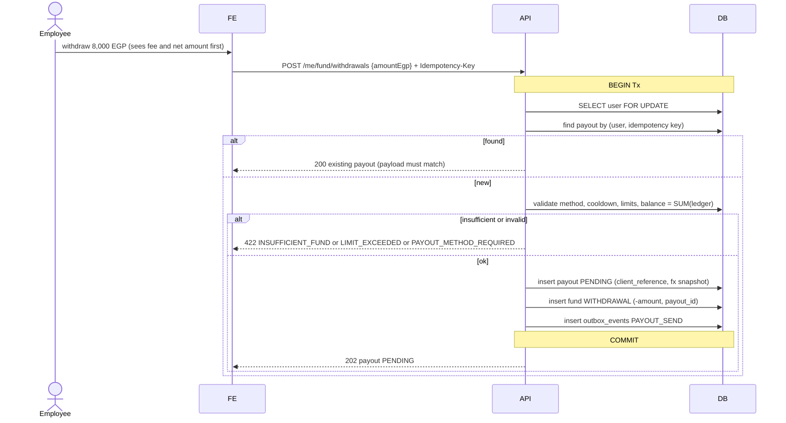
```mermaid
sequenceDiagram
  actor E as Employee
  participant FE
  participant API
  participant DB
  E->>FE: withdraw 8,000 EGP (sees fee and net amount first)
  FE->>API: POST /me/fund/withdrawals {amountEgp} + Idempotency-Key
  Note over API,DB: BEGIN Tx
  API->>DB: SELECT user FOR UPDATE
  API->>DB: find payout by (user, idempotency key)
  alt found
    API-->>FE: 200 existing payout (payload must match)
  else new
    API->>DB: validate method, cooldown, limits, balance = SUM(ledger)
    alt insufficient or invalid
      API-->>FE: 422 INSUFFICIENT_FUND or LIMIT_EXCEEDED or PAYOUT_METHOD_REQUIRED
    else ok
      API->>DB: insert payout PENDING (client_reference, fx snapshot)
      API->>DB: insert fund WITHDRAWAL (-amount, payout_id)
      API->>DB: insert outbox_events PAYOUT_SEND
      Note over API,DB: COMMIT
      API-->>FE: 202 payout PENDING
    end
  end
```

## 17. Paymob payout

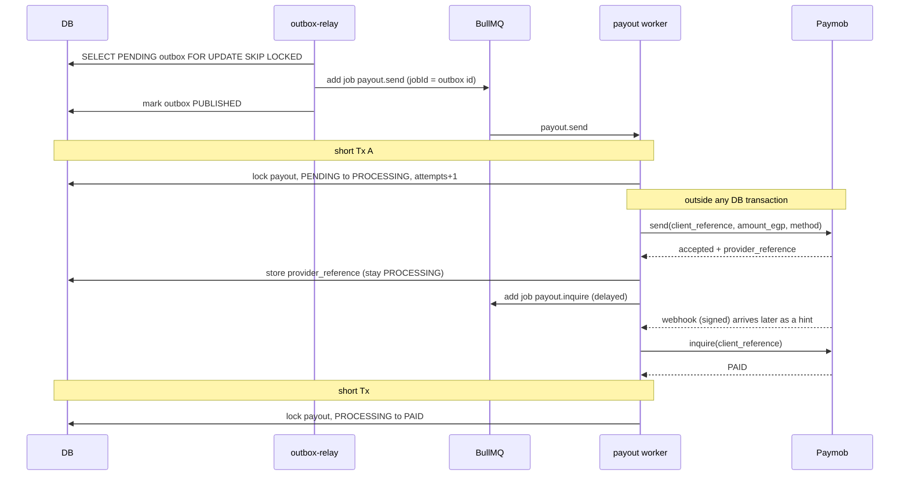
```mermaid
sequenceDiagram
  participant DB
  participant RL as outbox-relay
  participant Q as BullMQ
  participant W as payout worker
  participant PM as Paymob
  RL->>DB: SELECT PENDING outbox FOR UPDATE SKIP LOCKED
  RL->>Q: add job payout.send (jobId = outbox id)
  RL->>DB: mark outbox PUBLISHED
  Q->>W: payout.send
  Note over W,DB: short Tx A
  W->>DB: lock payout, PENDING to PROCESSING, attempts+1
  Note over W,PM: outside any DB transaction
  W->>PM: send(client_reference, amount_egp, method)
  PM-->>W: accepted + provider_reference
  W->>DB: store provider_reference (stay PROCESSING)
  W->>Q: add job payout.inquire (delayed)
  PM-->>W: webhook (signed) arrives later as a hint
  W->>PM: inquire(client_reference)
  PM-->>W: PAID
  Note over W,DB: short Tx
  W->>DB: lock payout, PROCESSING to PAID
```

## 18. Paymob timeout + inquiry

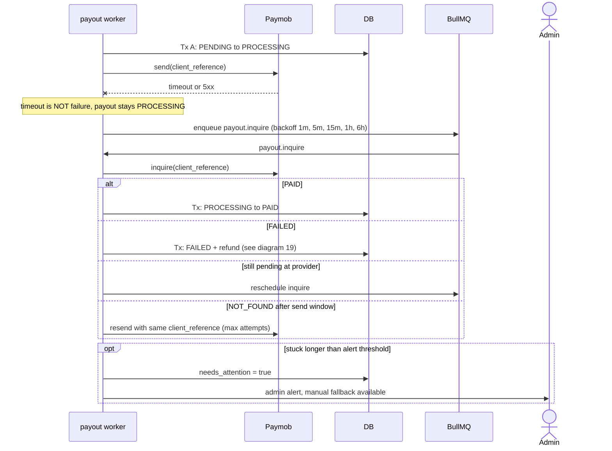
```mermaid
sequenceDiagram
  participant W as payout worker
  participant PM as Paymob
  participant DB
  participant Q as BullMQ
  actor A as Admin
  W->>DB: Tx A: PENDING to PROCESSING
  W->>PM: send(client_reference)
  PM--xW: timeout or 5xx
  Note over W: timeout is NOT failure, payout stays PROCESSING
  W->>Q: enqueue payout.inquire (backoff 1m, 5m, 15m, 1h, 6h)
  Q->>W: payout.inquire
  W->>PM: inquire(client_reference)
  alt PAID
    W->>DB: Tx: PROCESSING to PAID
  else FAILED
    W->>DB: Tx: FAILED + refund (see diagram 19)
  else still pending at provider
    W->>Q: reschedule inquire
  else NOT_FOUND after send window
    W->>PM: resend with same client_reference (max attempts)
  end
  opt stuck longer than alert threshold
    W->>DB: needs_attention = true
    W->>A: admin alert, manual fallback available
  end
```

## 19. Failed payout + refund

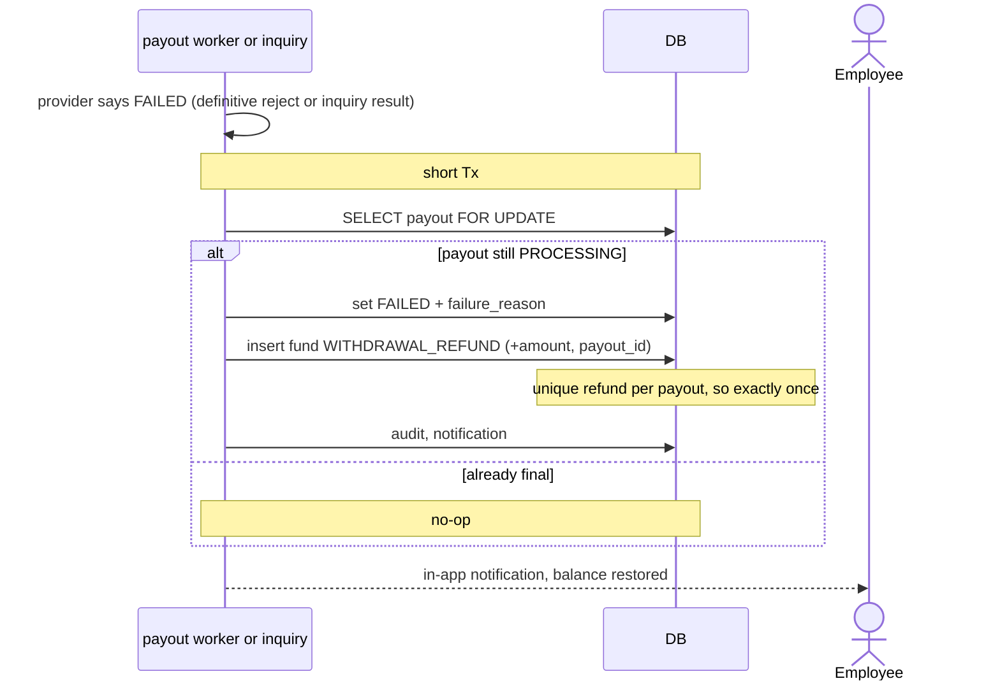
```mermaid
sequenceDiagram
  participant W as payout worker or inquiry
  participant DB
  actor E as Employee
  W->>W: provider says FAILED (definitive reject or inquiry result)
  Note over W,DB: short Tx
  W->>DB: SELECT payout FOR UPDATE
  alt payout still PROCESSING
    W->>DB: set FAILED + failure_reason
    W->>DB: insert fund WITHDRAWAL_REFUND (+amount, payout_id)
    Note over DB: unique refund per payout, so exactly once
    W->>DB: audit, notification
  else already final
    Note over W,DB: no-op
  end
  W-->>E: in-app notification, balance restored
```

## 20. Admin reviewing employee attendance

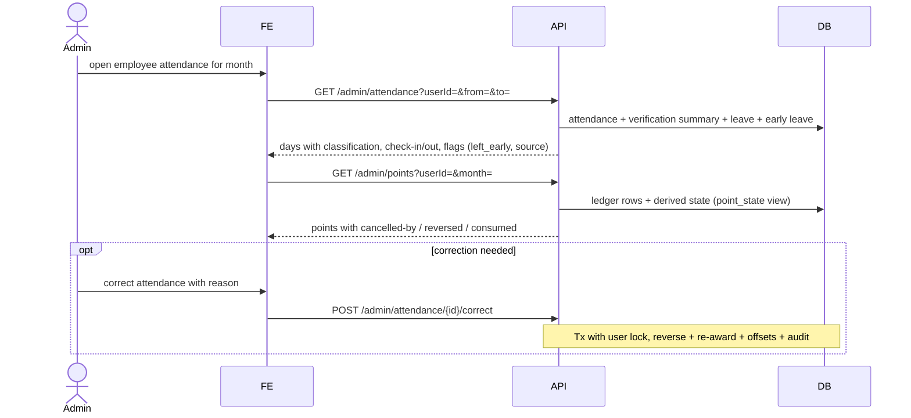
```mermaid
sequenceDiagram
  actor A as Admin
  participant FE
  participant API
  participant DB
  A->>FE: open employee attendance for month
  FE->>API: GET /admin/attendance?userId=&from=&to=
  API->>DB: attendance + verification summary + leave + early leave
  API-->>FE: days with classification, check-in/out, flags (left_early, source)
  FE->>API: GET /admin/points?userId=&month=
  API->>DB: ledger rows + derived state (point_state view)
  API-->>FE: points with cancelled-by / reversed / consumed
  opt correction needed
    A->>FE: correct attendance with reason
    FE->>API: POST /admin/attendance/{id}/correct
    Note over API,DB: Tx with user lock, reverse + re-award + offsets + audit
  end
```
